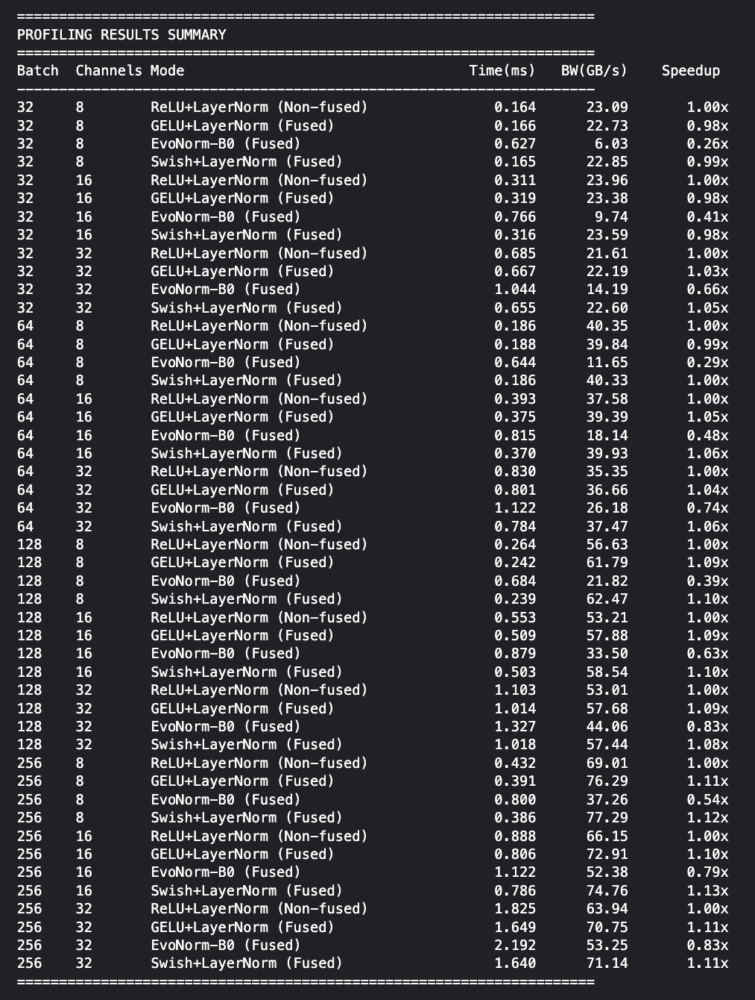
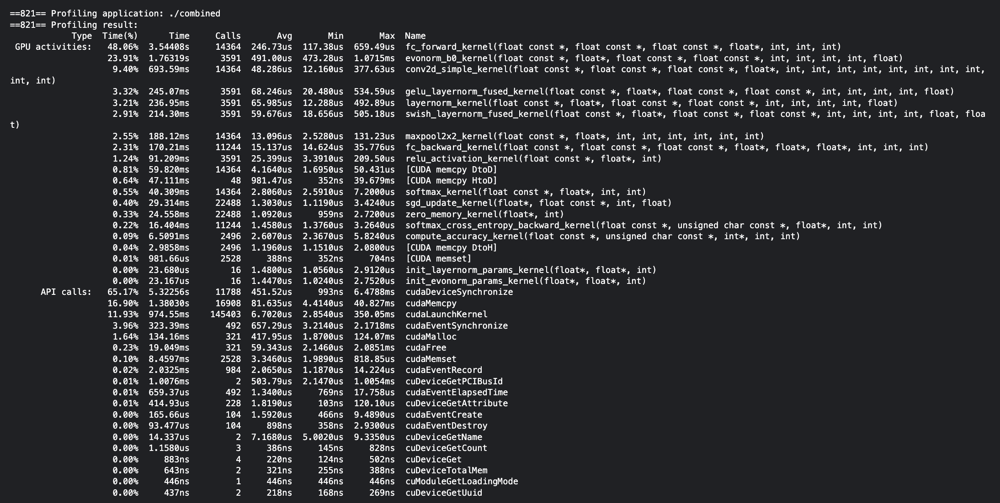

# CNN Kernel Fusion Performance Comparison

CUDA and Triton implementation of CNN with kernel fusion techniques for performance optimization.

## Overview

This project implements a convolutional neural network (CNN) for MNIST digit classification using CUDA and Triton. The main focus is comparing kernel fusion techniques that combine activation and normalization operations to reduce memory bandwidth and improve performance.

### Implemented Fusion Techniques

1. **Mode 0 (Baseline)**: ReLU + LayerNorm => separate kernel launches
2. **Mode 1**: GELU + LayerNorm => fused into single kernel
3. **Mode 2**: EvoNorm-B0 => inherently fused activation-normalization from NeurIPS 2020
4. **Mode 3**: Swish + LayerNorm => fused into single kernel

## Directory Structure
```
.
├── CUDA/
│   ├── CNN/                          # Main CUDA implementation
│   │   ├── activation_kernels.cu     # GELU, Swish activation functions
│   │   ├── basic_kernels.cu          # Conv2D, ReLU, MaxPool, FC layer
│   │   ├── normalization_kernels.cu  # LayerNorm, EvoNorm-B0
│   │   ├── fused_kernels.cu          # Fused activation+normalization kernels
│   │   ├── training_kernels.cu       # Backward pass, SGD optimizer
│   │   ├── model.cu                  # Model allocation and initialization
│   │   ├── forward_pass.cu           # Forward pass for all 4 modes
│   │   ├── training_ops.cu           # Training step implementation
│   │   ├── main_combined.cu          # Main training and profiling program
│   │   ├── mnist_loader.cu           # MNIST dataset loader
│   │   └── cuda_utils.cu             # CUDA utilities and error checking
│   │
│   └── Gearing up/                   # Practice/experimental code
│
├── Triton/
│   ├── CNN/                          # Main Triton implementation
│   │   ├── activation_kernels.py     # Triton activation kernels
│   │   ├── basic_layers.py           # Triton basic layer kernels
│   │   ├── normalization_kernels.py  # Triton normalization kernels
│   │   ├── fused_kernels.py          # Triton fused kernels
│   │   ├── model.py                  # Model structure
│   │   ├── forward_pass.py           # Forward pass implementation
│   │   ├── training_ops.py           # Training operations
│   │   ├── main_combined.py          # Main program
│   │   ├── mnist_loader.py           # MNIST loader
│   │   └── triton_utils.py           # Triton utilities
│   │
│   └── Gearing Up/                   # Practice Triton code
│
├── Pytorch + CUDA/                   # PyTorch reference implementation
│   ├── cnn_model.py                  # PyTorch CNN model
│   └── script.py                     # Training script
│
└── data/
    └── MNIST/raw/                    # MNIST dataset files
```

## Implementation Details

### CUDA Implementation

The CUDA implementation is split into modular components:

- **Basic Kernels**: Convolution, ReLU, MaxPooling, Fully Connected layers
- **Activation Kernels**: GELU (tanh approximation), Swish (x * sigmoid)
- **Normalization Kernels**: LayerNorm, EvoNorm-B0
- **Fused Kernels**: Single-kernel implementations combining activation + normalization
- **Training Kernels**: Backpropagation, gradient computation, SGD weight updates

### Triton Implementation

Triton implementation mirrors the CUDA structure using Triton's Python-based kernel programming model.

### Model Architecture
```
Input (28x28x1)
    ↓
Conv2D (3x3, 16 filters)
    ↓
Activation + Normalization (varies by mode)
    ↓
MaxPool (2x2)
    ↓
Fully Connected (10 classes)
    ↓
Softmax
```

## Performance Metrics

The implementations measure:

- Kernel execution time (ms)
- Memory throughput (GB/s)
- Training time per epoch
- Speedup vs baseline
- Test accuracy

Testing configurations:
- Batch sizes: 32, 64, 128, 256
- Channel counts: 8, 16, 32
- Image size: 28x28 (MNIST)

## Building and Running

### CUDA Version
```bash
nvcc -o cnn_training CUDA/CNN/main_combined.cu -O3 -arch=sm_75
nvprof ./cnn_training
```

### Triton Version
```bash
python Triton/CNN/main_combined.py
```

## Results

Training achieves 95-96% accuracy on MNIST test set across all fusion modes.

Performance varies by configuration:
- Fused kernels reduce memory traffic by eliminating intermediate storage
- Speedup depends on batch size and tensor dimensions
- Complex activations (GELU, Swish) improve accuracy but cost performance

## Dataset

MNIST handwritten digit dataset:
- Training: 60,000 images
- Testing: 10,000 images
- Image size: 28x28 grayscale

## Requirements

- CUDA Toolkit 11.0+
- Python 3.8+
- Triton (for Triton implementation)
- PyTorch (for reference implementation)

## Results

### Profiling Results
#### CUDA Profiling Results Summary

#### CUDA nvprof Profiling Results Summary

#### Triton Profiling Results Summary


### Training Results
#### CUDA Training Results Summary

#### Triton Training Results Summary


